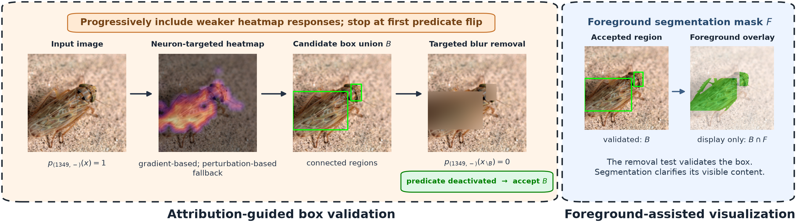

# VisionLogic

**Discovering and Grounding Decision-Relevant Visual Concepts**

Chuqin Geng, Yuhe Jiang, Li Zhang, Zhaoyue Wang, Haolin Ye, Mark Zhang, Jingkai Xu, and Xujie Si

[](https://github.com/allengeng123/VisionLogic/actions/workflows/tests.yml)
[](LICENSE)

VisionLogic explains a frozen vision model's prediction with a compact set of
internal features, expresses their activation states as class-specific predicates,
and grounds active, selected predicates in image regions using removal tests.



**Start here:** [Installation](#installation) · [Explain an image](#explain-an-image) ·
[Reproduce the analysis](docs/REPRODUCIBILITY.md) · [Data and outputs](docs/DATA.md)

## What is included

- A CPU/CUDA command for explaining a user-provided image with Grad-CAM, Score-CAM fallback, and Gaussian-blur removal.
- Checksum-verified downloads of the four frozen torchvision classifiers.
- ImageNet activation extraction, pathway selection, predicate fitting, and held-out analysis.
- Frozen predicate tables and compact numerical results from the earlier experimental runs.
- Grounding evaluation scripts with area-matched random controls, regression tests, and continuous integration.

**Protocol note:** the current manuscript specifies correctly classified source
images and stable sorting for all four models. The earlier saved results and
bundled predicate tables were generated with majority-predicted source groups
and model-specific sorting. They are retained as `legacy` artifacts, not presented
as newly reproduced manuscript-protocol results. New pathway/analysis runs default
to `paper`; the ready-to-run image demo explicitly uses the bundled `legacy`
thresholds. See the [protocol comparison](docs/REPRODUCIBILITY.md#protocols).

## Installation

Use **Python 3.10–3.12** in a fresh environment. The dependency versions below are
pinned; CPU execution works for the single-image demo and tests. Large-scale
experiments should use an NVIDIA GPU.

```bash
git clone https://github.com/allengeng123/VisionLogic.git
cd VisionLogic
python -m venv .venv
source .venv/bin/activate
python -m pip install --upgrade pip
```

On Windows PowerShell, replace the activation command with
`.\.venv\Scripts\Activate.ps1`. The remaining single-line commands work in both shells.

Install **one** matching PyTorch/torchvision pair:

```bash
# CPU
python -m pip install torch==2.5.1 torchvision==0.20.1 --index-url https://download.pytorch.org/whl/cpu
```

```bash
# NVIDIA CUDA 12.1, instead of the CPU command
python -m pip install torch==2.5.1 torchvision==0.20.1 --index-url https://download.pytorch.org/whl/cu121
```

Then install and check the project dependencies:

```bash
python -m pip install -r requirements.txt
python -m pip check
```

For another GPU platform, consult the [official PyTorch wheel matrix](https://pytorch.org/get-started/previous-versions/#v251).
The package versions in this release are an installation baseline, not a claim
that all archived experiments ran in this exact environment.

## Explain an image

Download the ResNet-50 checkpoint, then run your image through the full grounding
procedure. No ImageNet download, private notebook, segmentation model, or training
run is needed for this example.

```bash
python download_weights.py --models resnet
python explain.py --image /path/to/image.jpg --model resnet --protocol legacy --device cpu --output outputs/my-image
```

Use `--device cuda` for GPU execution. Supported model keys are `vit`, `resnet`,
`convnext`, and `swin`; download the corresponding weights first. Score-CAM can be
slow on CPU because it evaluates every channel of the selected spatial layer.

The command saves:

| File | Contents |
| --- | --- |
| `input.png` | The exact 224 × 224 input crop seen by the model |
| `explanation.json` | Predicted class index, selected pathway, fixed thresholds, every attempted intervention, success/failure, and input hashes |
| `predicate_*_boxes.png` | Accepted box unions drawn on the input |
| `predicate_*_mask.png` | Binary accepted-region mask; empty if grounding fails |
| `predicate_*_removed.png` | Accepted blur intervention, when a predicate is deactivated |
| `predicate_*_heatmap.npy` | Heatmap for the accepted stage, or final attempted stage on failure |

Predicates without an accepted region remain in the JSON. An image can have no
active selected predicates; this is reported explicitly. The command refuses to
overwrite an existing output directory.

After fitting thresholds with the manuscript protocol, run:

```bash
python explain.py --image /path/to/image.jpg --model resnet --protocol paper --predicates outputs/paper/resnet/predicate_metrics.csv.gz --device cuda --output outputs/paper-image
```

## How it works

1. Compute the frozen model prediction and the exact input to its final linear layer.
2. Rank signed feature contributions to the predicted class; keep the first prefix whose partial logits recover that prediction.
3. Look up the predicted class's frozen predicates and retain those that are both selected and active.
4. Build a neuron-targeted Grad-CAM map. At cutoffs 0.60, 0.55, …, 0.10, take all eight-connected components and test the union of their bounding boxes.
5. Blur the image with radius 20 and replace only pixels inside the proposed region. Accept the first region that deactivates the same signed feature predicate at its unchanged threshold.
6. If all Grad-CAM proposals fail, repeat the fixed schedule with Score-CAM.

This explains the classifier's prediction; it does not train a replacement rule
classifier. An accepted region supports a one-way removal test, not a claim of
uniqueness, pixel minimality, or sufficiency. Foreground segmentation in the
paper is a display operation, not part of the acceptance rule; the default demo
shows the actual tested boxes.

## Reproduction and development

The [reproduction guide](docs/REPRODUCIBILITY.md) covers activation extraction,
source pathways, predicate fitting, analysis figures, and the grounding benchmark.
The [data guide](docs/DATA.md) describes ImageNet layout, checkpoint choices,
activation formats, and the provenance of bundled results.

```bash
python -m pip install -r requirements-dev.txt
python run_tests.py
```

Tests cover signed thresholds, prefix selection, source-population protocols,
connected regions, area matching, stopping/fallback behavior, and benchmark
aggregation. They run on CPU without ImageNet or downloaded classifier weights.
GitHub Actions runs the same suite.

| Path | Purpose |
| --- | --- |
| `explain.py` | Single-image grounding entry point |
| `download_weights.py` | Download and verify exact model checkpoints |
| `extract_activations.py` | Save final-head input features from ImageNet |
| `build_initial_pathway_checkpoints.py` | Extract prediction-preserving source pathways |
| `visionlogic_section42_predicate_analysis.py` | Fit predicates and generate numerical analysis; historical filename retained |
| `check_saved_activation_accuracy.py` | Check classifier accuracy from saved features; notebook audit is optional |
| `benchmark_report.py` | Summarize two-stage guided and matched-random results |
| `experimental_grounding/` | Shared implementation and historical experiment scripts |
| `results/` | Frozen legacy tables and summaries |
| `tests/` | CPU regression tests |

Some historical scripts require experiment-specific manifests or optional models.
See [experimental_grounding/README.md](experimental_grounding/README.md) before
using them; `run_demo.py` is an older integrated-gradients/inpainting experiment,
not the current paper's entry point.

## Citation

For the current manuscript/code release:

```bibtex
@misc{geng2026visionlogic,
  title = {VisionLogic: Discovering and Grounding Decision-Relevant Visual Concepts},
  author = {Geng, Chuqin and Jiang, Yuhe and Zhang, Li and Wang, Zhaoyue and Ye, Haolin and Zhang, Mark and Xu, Jingkai and Si, Xujie},
  year = {2026},
  howpublished = {Research manuscript and code},
  url = {https://github.com/allengeng123/VisionLogic}
}
```

The [earlier arXiv manuscript](https://arxiv.org/abs/2503.10547) has a different
title and author list; use the metadata of the version you actually cite.

## License and contact

The repository code is released under the [MIT License](LICENSE). ImageNet,
third-party model weights, and third-party software retain their own terms.

For usage questions and reproducible bug reports, open a
[GitHub issue](https://github.com/allengeng123/VisionLogic/issues).
Research contacts: Chuqin Geng (`chuqin.geng@mail.mcgill.ca`) and Xujie Si (`six@cs.toronto.edu`).
